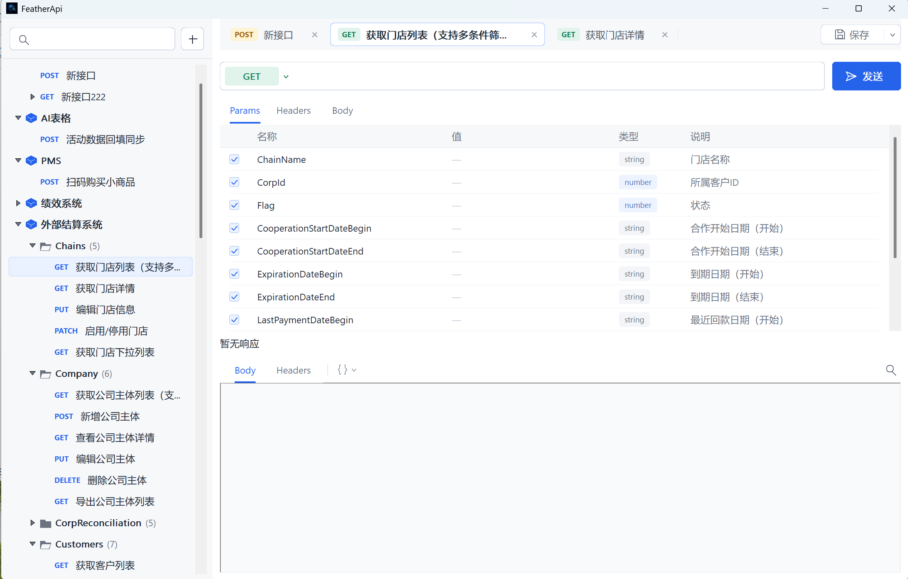

# FeatherApi

**Say goodbye to bloat and debug APIs with the power of a feather.**

[中文](README.zh-CN.md)

FeatherApi is an ultra-lightweight API debugging tool for Windows.



## Why FeatherApi?

- **No bloat**: Built with the native Windows Win32 UI and system networking stack, without Electron or a bundled browser runtime.
- **Fast and portable**: A native single-file application that is convenient to carry on a USB drive, in a developer toolkit, or on a CI workstation.
- **API organization**: Manage folders, subfolders, APIs, request examples, and copy, move, or rename APIs.
- **Complete request editing**: Supports GET, POST, PUT, PATCH, and DELETE, with editable query parameters, headers, JSON, raw, and form requests.
- **Readable responses**: View the status code, elapsed time, response size, response headers, and raw or formatted response body.
- **JSON tools**: Built-in JSON validation, formatting, and minification, with errors located as precisely as possible by line and column.
- **OpenAPI / Swagger**: Import OpenAPI 3 and Swagger 2 documents to automatically generate folders, request parameters, and JSON examples.
- **Local-first**: API data is stored locally, with no login or cloud account required.

## Lightweight Metrics

| Item | Current status |
| --- | --- |
| Core language | C++17 |
| UI technology | **Native Windows Win32 API + Common Controls** |
| HTTP implementation | Windows WinHTTP |
| Third-party runtime | No Electron / No .NET Runtime required |
| Package size | **Approximately 435 KB** |
| Idle memory usage | **Approximately 18.9 MB** |

FeatherApi stays lightweight by relying only on Windows system components, so no additional dependencies are required.

## Download and Build

### Download a Release

Windows x64 users can download the portable ZIP package from the [latest release](https://github.com/yangka1212/FeatherApi/releases/latest).

### CMake

```powershell
cmake -S . -B build -A x64
cmake --build build --config Release
ctest --test-dir build -C Release --output-on-failure
```

## Data Location

The default data file is located at:

```text
%LOCALAPPDATA%\FeatherApi-Win32\data.json
```

## License

The license file will be added before the first public release. If you plan to fork or redistribute this project, please confirm its license status first.
