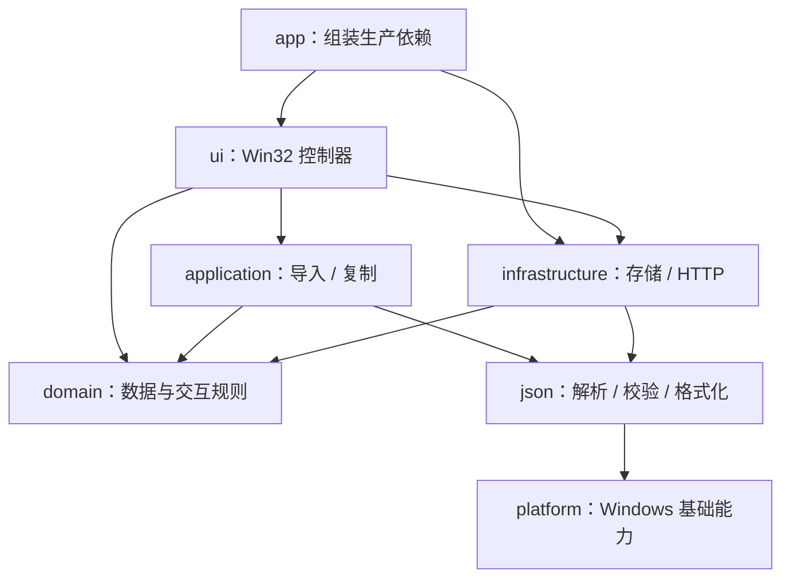

# 开发架构

FeatherApi 使用 C++17、Win32 和 WinHTTP。模块在编译时形成静态库，最终仍输出一个原生 EXE；不引入第三方运行时。CMake 是源码清单、编译选项、链接依赖和测试注册的唯一入口。

## 目录与职责

| 目录 | 职责 | CMake 目标 |
| --- | --- | --- |
| `src/domain` | 请求、用例、目录、响应模型；编辑基线、脏状态比较、导航及搜索规则；字段规范化 | `FeatherDomain` |
| `src/application` | OpenAPI / Swagger 文档映射、导入冲突处理、请求复制 | `FeatherApplication` |
| `src/infrastructure` | JSON 文件持久化、原子替换、损坏文件备份；WinHTTP、表单编码与文件读取 | `FeatherInfrastructure` |
| `src/json` | JSON 解析、校验、格式化和序列化公共能力 | `FeatherJson` |
| `src/platform` | Windows 头文件配置、UTF-8 转换、GUID 生成 | `FeatherPlatform` |
| `src/ui` | Win32 窗口、控件、事件、异步任务及界面状态 | `FeatherUi` |
| `src/app` | 程序入口及生产依赖组装 | `FeatherApi` |
| `tests` | 功能与真实 Win32 控制器回归 | 两个测试 EXE |
| `cmake` | 构建辅助、Visual Studio 兼容入口、依赖边界检查 | `FeatherArchitecture` 测试 |
| `scripts` | 工具链发现、构建、测试、打包入口 | — |



图中展示主要调用关系。UI 也直接使用 JSON 工具和平台工具；JSON 使用 domain 中的文本比较函数。`domain` 只使用标准库，不包含 Windows、UI、网络或文件存储接口。应用逻辑不调用存储层，导入函数接收文档内容和目标目录，由调用方决定如何获取文档与保存结果。

## 模块接口与约束

- 按需包含模块头文件，例如 `application/openapi_import.h`，不再使用聚合全部声明的 `app.h`。
- `domain/models.h` 只定义数据模型，不持有 HWND、HINTERNET 或线程；这些运行时资源归 UI / HTTP 实现所有。
- `json/json.h` 是校验、格式化的公共接口。`json/detail/value.h` 是应用导入和存储序列化共享的内部 JSON 表示；界面不应直接操作它。
- `MainWindowServices` 显式传入加载、保存和 TaskDialog 函数。生产依赖在 `src/app/main.cpp` 组装；测试使用独立文件和可控弹窗结果，不访问日常数据。
- 保留 WinHTTP 取消句柄接口和原有任务生命周期。HTTP 抽象、窗口内部状态对象及更细的控件拆分可随具体功能继续演进。
- `FeatherArchitecture` 检查模块间的本地头文件依赖，阻止 domain 依赖基础设施、应用逻辑反向依赖 UI 等情况。新增模块时需要明确更新允许关系。

UI 测试目前仍通过包含 `ui/main_window.cpp` 访问内部控制器，测试目标不再链接 `FeatherUi`，因此不会重复定义。依赖替换已改为 `MainWindowServices`，不再通过宏重命名生产函数。主窗口仍是单窗口控制器，内部保留原有状态与事件处理；本次重构没有把它改造成完整的 MVC 框架。

## 开发命令

要求 Windows、Visual Studio C++ x64 工具和 Windows SDK，以及 CMake 3.20+、Ninja。推荐安装 Visual Studio 的 C++ CMake 工具组件。脚本通过 `vswhere` 发现安装位置，支持不同 VS 版本及版本类型。

在项目根目录运行：

```powershell
# 默认 Release 构建；产物位于 build/release
powershell -NoProfile -ExecutionPolicy Bypass -File scripts/build.ps1

# Debug 构建并运行所有回归
powershell -NoProfile -ExecutionPolicy Bypass -File scripts/build.ps1 -Action Test -Configuration Debug

# Release 构建并运行所有回归
powershell -NoProfile -ExecutionPolicy Bypass -File scripts/build.ps1 -Action Test

# 只构建主程序
powershell -NoProfile -ExecutionPolicy Bypass -File scripts/build.ps1 -Target FeatherApi

# 重新编译；Clean 操作只清理当前配置的构建产物
powershell -NoProfile -ExecutionPolicy Bypass -File scripts/build.ps1 -Rebuild

# 打包至 dist/FeatherApi.exe，也可传入其他 EXE 文件名
.\package-exe.cmd
.\package-exe.cmd FeatherApi-custom.exe
```

打包会覆盖 `dist` 下的同名 EXE，保留构建缓存，便于重复打包。Debug 和 Release 都使用静态 MSVC 运行库；Release 开启链接时优化和函数级链接。

已经初始化 x64 开发环境时，也可直接使用预设：

```powershell
cmake --preset release
cmake --build --preset release
ctest --preset release
```

已有三个 `.vcxproj` 保留为 Visual Studio Makefile 兼容入口，转发到同一构建脚本，不再重复列出编译源文件。推荐在 Visual Studio 中直接打开项目文件夹，使用 CMake。各兼容入口共享同配置的构建目录，应依次构建；Clean 会清理该配置的全部目标。

常规 CMake 配置仍受支持，例如 `cmake -S . -B build/custom -G Ninja -DCMAKE_BUILD_TYPE=Release -DBUILD_TESTING=OFF` 可只生成产品目标；此时使用 `cmake --build build/custom --target FeatherApi`。自定义 Ninja 构建需先初始化工具链。

## 测试与开发规则

- `FeatherArchitecture`：模块依赖边界。
- `FeatherApiSelfTests`：数据往返和旧格式兼容、JSON、OpenAPI、请求复制、编辑状态、本地 HTTP、响应大小限制与取消。
- `FeatherApiUiTests --test`：真实 Win32 控制器的保存失败、关闭确认、标签页、键盘导航和布局规则。测试使用 EXE 旁的独立 `ui-sandbox` 目录。

新增源文件只需加入对应 CMake 目标；修改界面行为时更新控制器回归，修改导入、存储或请求行为时更新功能回归。避免把业务规则重新放进窗口消息分发或存储代码。各头文件自行包含所需依赖。

本次保留原有 JSON 字段、默认数据位置 `%LOCALAPPDATA%\FeatherApi-Win32\data.json`、损坏文件备份与临时文件替换逻辑，无需迁移用户数据。自动测试不能代替真实显示器上的视觉、鼠标和输入法检查。
